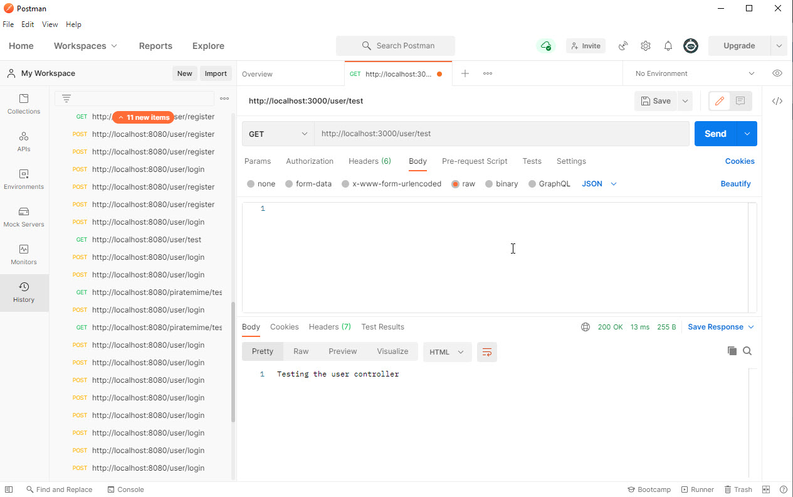
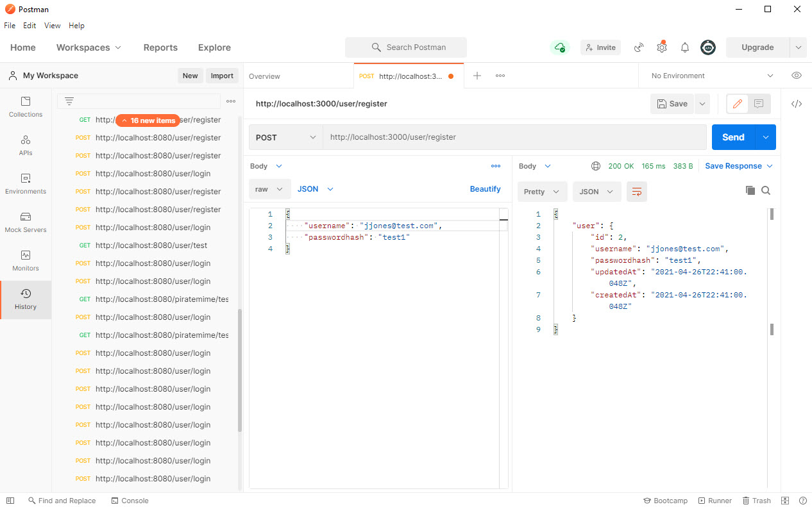
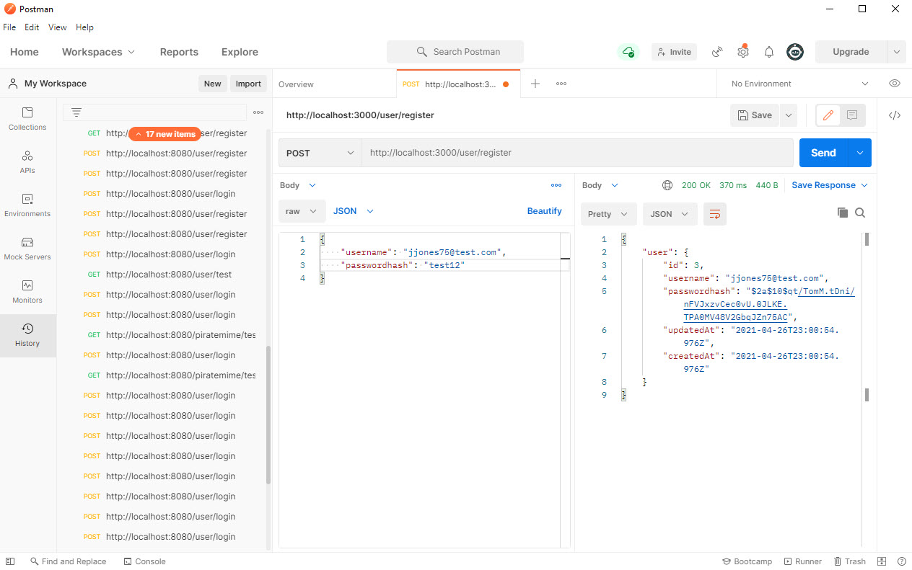
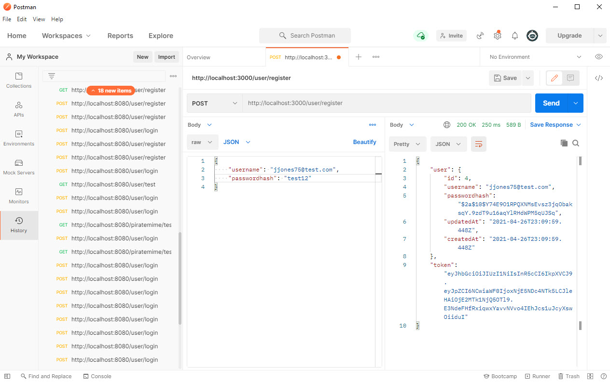
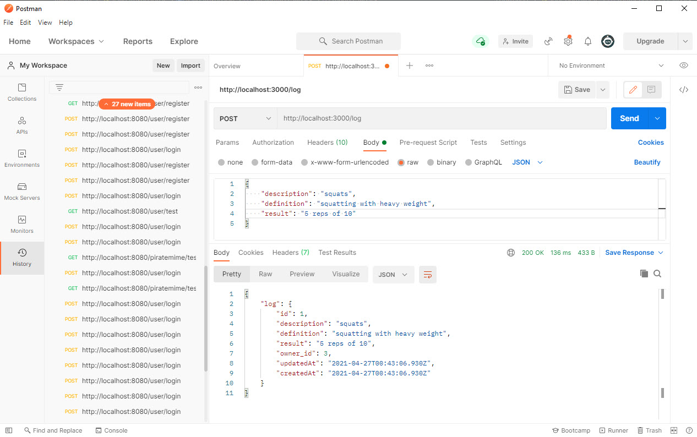
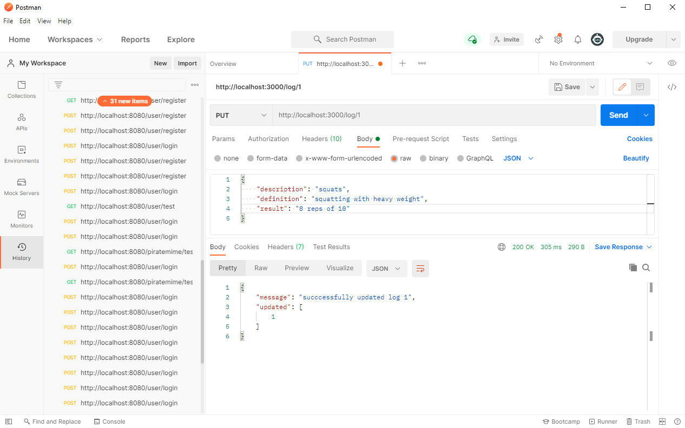
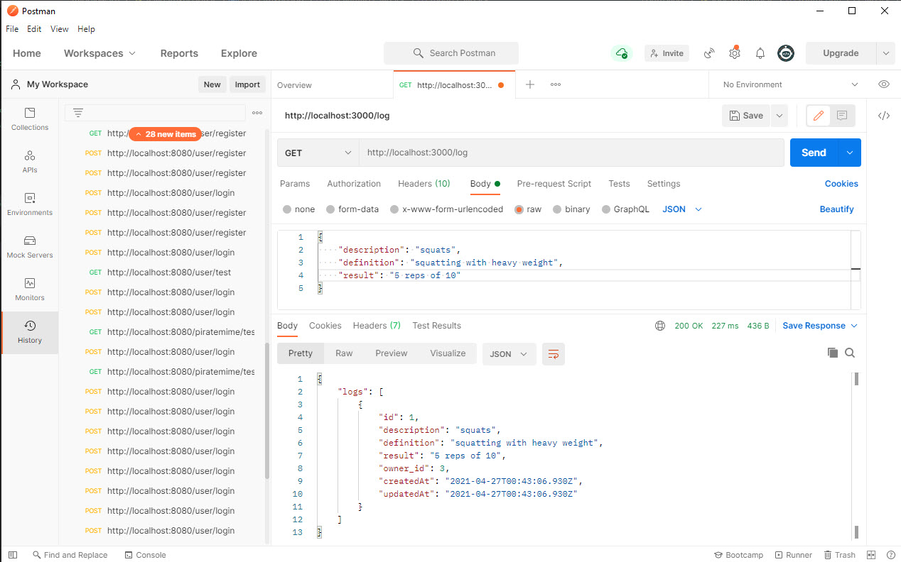
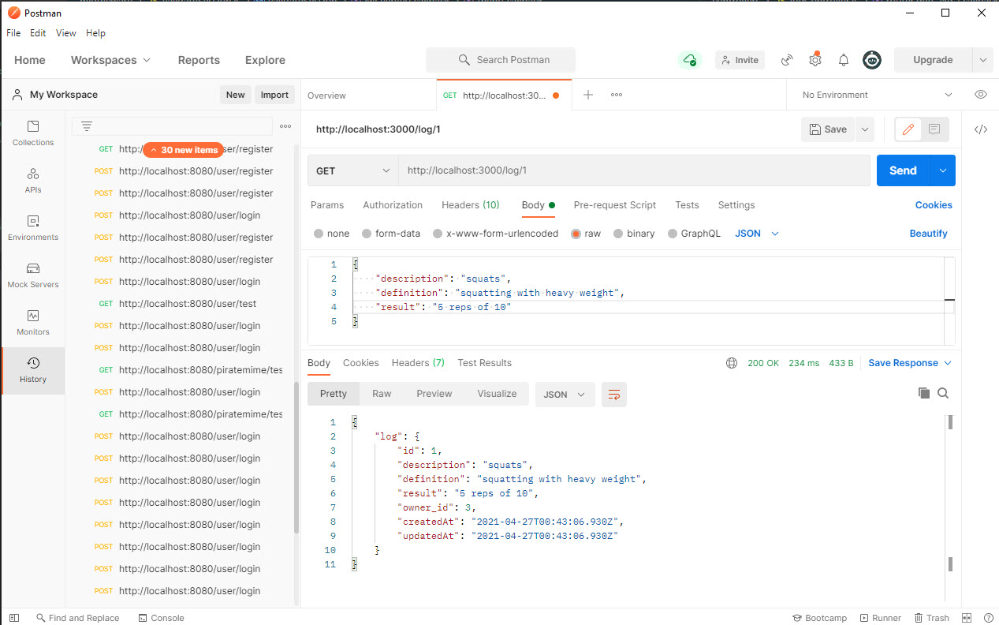
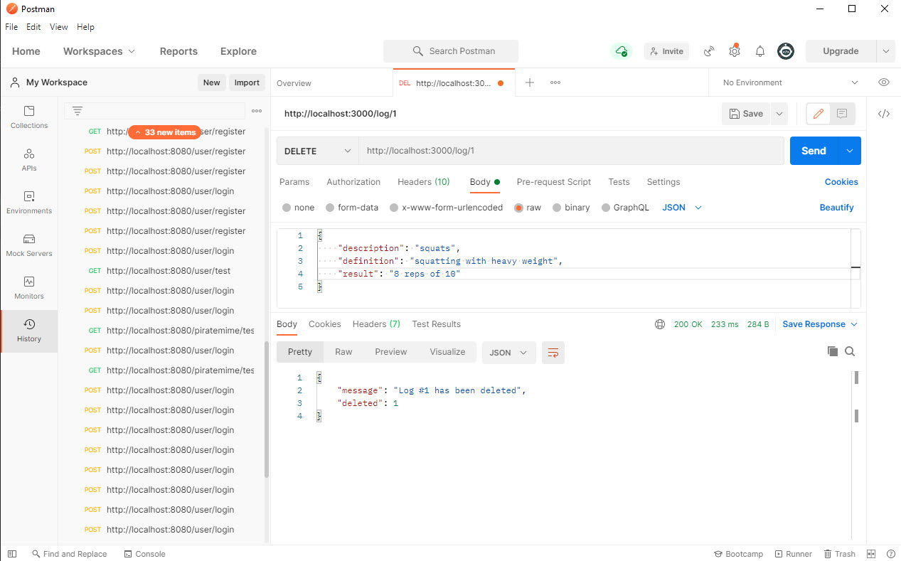

# WorkoutLog-Server

# UserController Test

# User Register Test

# Login Test

# Bcrypt Test

# Token Test

# Log Post Test

# Log Update Test

# Get All Logs Test

# Get By ID Test

# Log Delete Test

